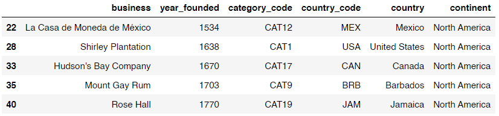
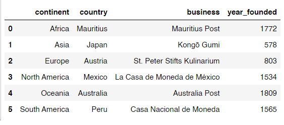
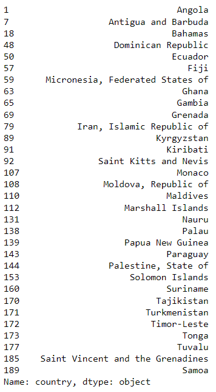
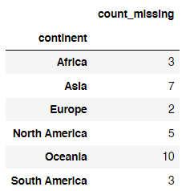
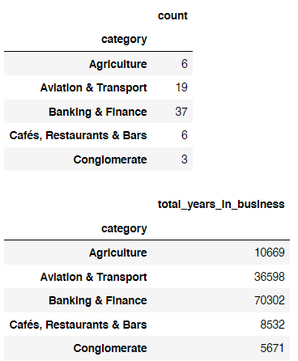
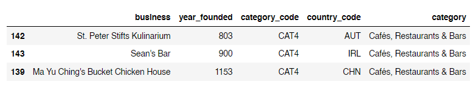
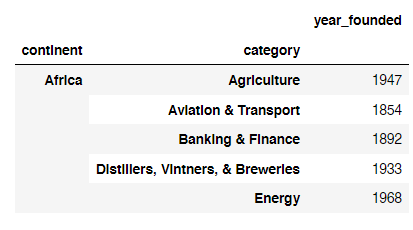

# What-and-Where-are-the-World-s-Oldest-Businesses
Use joining techniques to discover the oldest businesses in the world.


## Overview
In this project, we explore data from BusinessFinancing.co.uk on the world's oldest businesses. The main goal is to understand the factors contributing to the longevity of businesses and provide insights into historical trends. The analysis involves merging datasets, using manipulation tools, and addressing specific tasks to extract valuable information.

# Project Structure

- `datasets/`: Contains the dataset used for analysis.
- `images/`: Visualizations and plots generated during the analysis.
- `notebooks/`: Jupyter notebooks for exploratory data analysis, feature engineering, and modeling.

## Getting Started

1. **Clone the Repository:**
   ```bash
   git clone https://github.com/AyazRao/What-and-Where-are-the-World-s-Oldest-Businesses.git
   cd What-and-Where-are-the-World-s-Oldest-Businesses

## Key Features
- **Data Exploration:** Comprehensive exploration of historical business data.
- **Task-oriented Analysis:** Structured approach with distinct tasks for in-depth investigation.
- **Insight Generation:** Uncover patterns and characteristics that enable businesses to endure over time.

## Project Structure
The project is organized into tasks, each focusing on a specific aspect of the dataset. The key components include:

1. **Task 1:** Data exploration and sorting businesses by founding date.
2. **Task 2:** Identifying the oldest businesses in North America.
3. **Task 3:** Determining the oldest business on each continent.
4. **Task 4:** Identifying countries with unknown oldest businesses.
5. **Task 5:** Adding new oldest business data to enhance the dataset.
6. **Task 6:** Analyzing the oldest industries using category information.
7. **Task 7:** Discovering the oldest restaurants in the world.
8. **Task 8:** Creating a reference table showing the oldest business in each category by continent.

## Getting Started
To get started with the project, follow these steps:
1. Clone the repository to your local machine.
2. Install the required dependencies, including pandas.
3. Explore the datasets in the "datasets" directory.
4. Execute tasks in sequential order for a comprehensive analysis.

## Tasks
The project is divided into multiple tasks, each outlined with specific instructions. Follow the instructions for each task to progress through the analysis and gain valuable insights into the world's oldest businesses.

1. **Task 1:** Data exploration and sorting businesses by founding date.

2. **Task 2:** Identifying the oldest businesses in North America.

3. **Task 3:** Determining the oldest business on each continent.

4. **Task 4:** Identifying countries with unknown oldest businesses.

5. **Task 5:** Adding new oldest business data to enhance the dataset.

6. **Task 6:** Analyzing the oldest industries using category information.

7. **Task 7:** Discovering the oldest restaurants in the world.

8. **Task 8:** Creating a reference table showing the oldest business in each category by continent.
